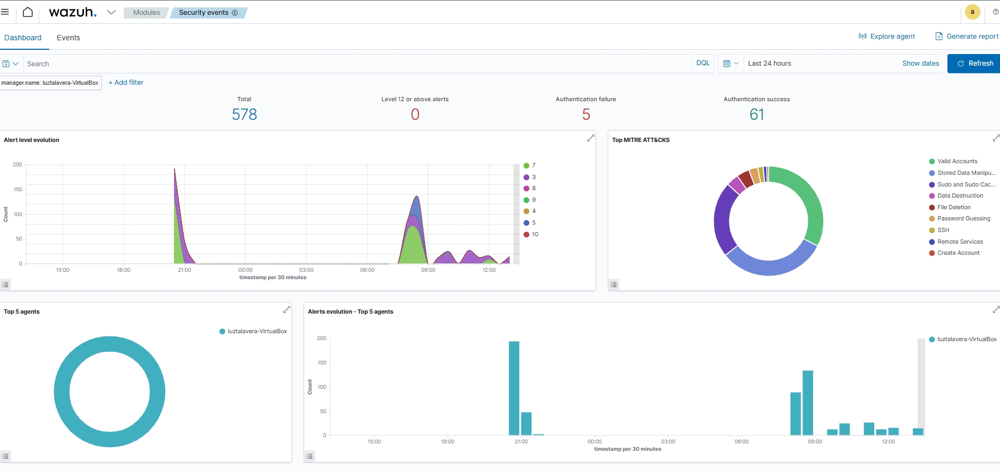
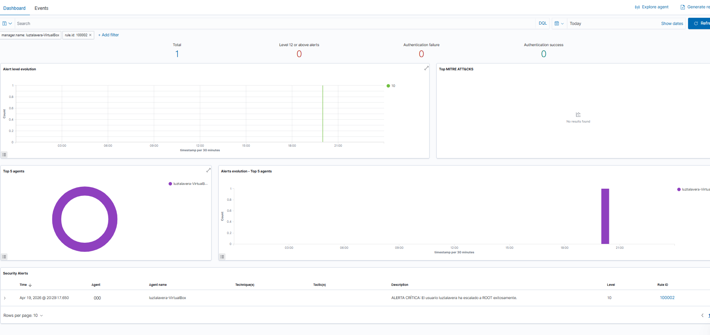
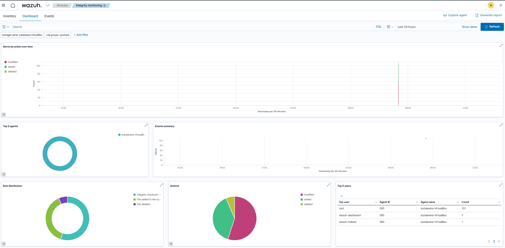

# 🛡️ Implementación de SIEM/XDR con Wazuh
> **Proyecto de Monitoreo de Seguridad, Análisis de Amenazas y Auditoría de Sistemas.**

## 👤 Información del Proyecto
*   **Autora:** Luz María Talavera Martínez
*   **Fecha:** 19 de abril de 2026
*   **Rol:** Analista de Seguridad / Estudiante de Ciberseguridad

---

## 📖 Descripción General
Este repositorio documenta el despliegue completo de un entorno de monitoreo de seguridad profesional utilizando el stack de **Wazuh**. El laboratorio se enfoca en la centralización de logs, detección de anomalías en tiempo real y el cumplimiento de estándares de seguridad mediante el mapeo de tácticas y técnicas del framework **MITRE ATT&CK**.

## 🧠 Colaboración Estratégica con IA
Este proyecto destaca por el uso de **Inteligencia Artificial** como mentor técnico y guía de resolución de problemas. La IA permitió:
*   **Optimización de Recursos:** Configuración de servicios críticos (Indexer, Manager, Dashboard) para operar de forma estable en un entorno de baja RAM (3.8GB totales / 1.3GB disponibles).
*   **Troubleshooting Avanzado:** Resolución de conflictos de comunicación en la API de Wazuh y depuración de errores de conexión entre componentes.
*   **Interpretación de Logs:** Apoyo en la correlación de eventos y traducción de tácticas técnicas a un contexto operativo de un SOC Analyst.

---

## 🛠️ Stack Tecnológico
*   **Wazuh 4.7.5:** Motor central de detección y respuesta (Manager, Indexer, Dashboard).
*   **Ubuntu 22.04 LTS:** Sistema operativo host (luztalavera-VirtualBox).
*   **Oracle VirtualBox:** Plataforma de virtualización con configuración de Port Forwarding (4443 -> 443).

---

## 📈 Hitos Logrados y Evidencias

### 1. Monitoreo de Eventos en Tiempo Real
Se logró la captura y análisis de alertas críticas, priorizando la detección de accesos no autorizados, ataques de fuerza bruta por SSH y monitoreo de sesiones exitosas.

*Vista general del panel de control con métricas de autenticación y evolución de alertas por nivel.*

---

### 2. Detección de Elevación de Privilegios (Regla Personalizada)
Implementación de la **Regla ID 100002** (Nivel 10) para detectar ejecuciones exitosas de `sudo` a `root`. Esta regla personalizada permite al analista diferenciar rápidamente acciones administrativas críticas del ruido normal del sistema.

*Análisis forense de la regla personalizada activada durante una escalada de privilegios.*

---

### 3. Monitoreo de Integridad de Archivos (FIM)
Configuración del módulo **File Integrity Monitoring**, permitiendo la auditoría en tiempo real de archivos críticos. El sistema detecta y clasifica archivos añadidos, modificados y eliminados para prevenir manipulaciones no autorizadas.

*Panel de control del módulo FIM con la distribución de cambios realizados en el sistema de archivos.*

---

## 📜 Automatización y Soporte
Para facilitar el despliegue del laboratorio en cualquier entorno, se han incluido scripts de automatización:
*   `install.sh`: Script para la instalación limpia (All-in-One) de Wazuh v4.7.5 optimizado para entornos de baja memoria.
*   `scripts/`: Herramientas adicionales para verificación de salud del sistema y generación de logs de prueba.

---

## ⚖️ Estándares de Seguridad
Este laboratorio ha sido configurado tomando como referencia:
- **MITRE ATT&CK**: Mapeo de técnicas de fuerza bruta (T1110.001) y escalada de privilegios (T1548.003).
- **PCI DSS / NIST**: Monitoreo de logs de autenticación y auditoría de integridad de archivos.

---

## Track Road Map / Mejoras Futuras
- [ ] Implementar **Active Response** para bloquear IPs automáticamente tras detectar ataques.
- [ ] Desplegar un agente en **Windows Server** para monitorear eventos de Directorio Activo.
- [ ] Integrar alertas personalizadas ligeras mediante Webhooks.

## 🏁 Conclusión
Este laboratorio demuestra la capacidad de implementar soluciones de seguridad de nivel empresarial en entornos controlados, validando competencias técnicas en administración de Linux, análisis de logs y el uso de **IA** para acelerar el aprendizaje y la resolución de incidentes complejos.
